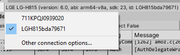
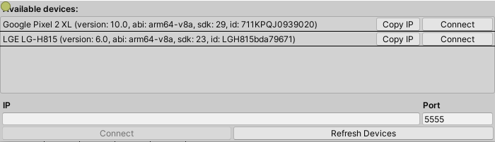

### Device Connection
Connecting devices through USB and Wifi are both supported.

**Device Selection**  
The device list contains all the connnected devices, but you can only select one device at a time from the list.

**Connect via USB**  
The devices connected through USB will be added to the device list automatically when starting Android logcat window. 

**Connect via Wifi**  
Go to the devices list and click **Other connection options**.

Window to enter an ip address will open.

If you want to manually enter the device IP, please follow the instructions in the [Android ADB Document](https://developer.android.com/studio/command-line/adb#wireless) to switch your device to TCP mode first.

If the device you want to connect through Wifi is already connected through USB you can simply click **Connect** .

