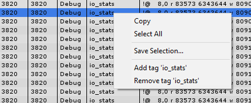
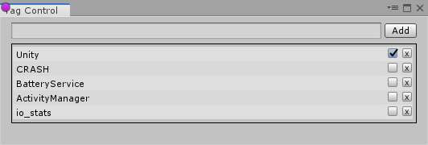

#### Filter
- By Priority  
  You can right click on the **Priority** column to select or deselect priorities. Priorities are predefined according to the [Android Logcat Document](https://developer.android.com/studio/command-line/logcat#filteringOutput).

- By Tag  
  Right click on the **Tag** column to select or deselect tags. You can also add or remove a tag by following these steps:
  	1. Find a message with the tag you want to add.
	2. Right click on the message and select **Add Tag** or **Remove Tag**.  
	

  You can also open the tag control window to manipulate tags by following steps:
  	1. Click the **Tag** column to show the menu.
	2. Click **Tag Control** menu item to show the **Tag Control Window**.  
	!
- By Process Id
    1. Right click on the message and select **Filter by process id** 