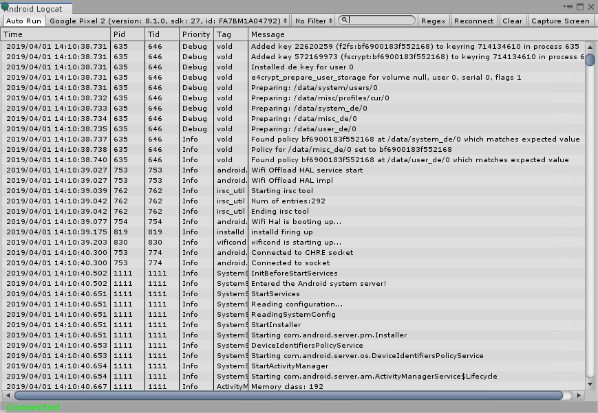

## **Installing Android Logcat** 
To install Android Logcat package, follow the instructions in the [Package Manager documentation](https://docs.unity3d.com/Packages/com.unity.package-manager-ui@latest/index.html). 

You can access Android Logcat window in the Unity Editor via
- Menu: **Window \> Analysis \> Android Logcat**
- Shortcut: **Alt+6** on Windows, **Option+6** on macOS.

