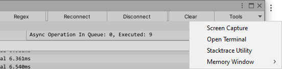
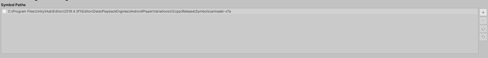
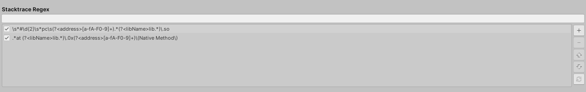
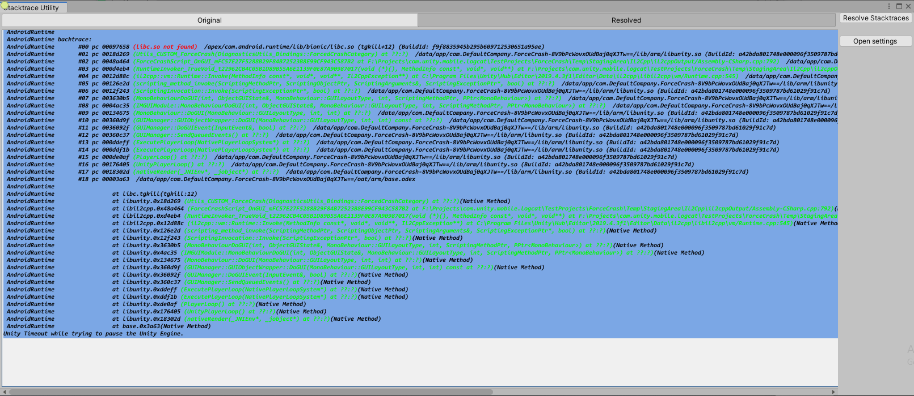

### Stacktrace Utility

**Stacktrace Utility** is available from Tools menu.

 

 

Allows you to copy and paste custom log and resolve stacktraces.

#### Configure Symbol Paths

Before using the tool, you need to setup symbol paths in the **Project Settings->Analysis->Android Logcat Settings**, so symbols for libraries like libunity.so, libmain.so, libil2cpp.so can be found.

Click **+** button and pick a symbol path from Unity installation or a custom location.

**Note:** Symbol Paths settings are saved per project.

* libmain.so - native library containing Unity loader code.
* libunity.so - native library containing Unity engine code.
* libil2cpp.so - native library containing user code, C# from Unity project ends up here.

Symbol path varies dependening on:

  - Scripting backend mono or il2cpp
  - Build configuration - development (pick **Development** folder) or non development (pick **Release** folder)
  - CPU architecture
  - Strip Engine Code setting in Player Settings (only applies for il2cpp)
  
Symbols for **libil2cpp.so**:

  - Are located in \*.symbols.zip file, assuming you selected **Create symbols.zip** in Build Settings window.

Symbols for **libunity.so**:

  - If Strip Engine Code is enabled (only applies for il2cpp), libunity.so symbols will be located in *.symbols.zip file.
  - If Strip Engine Code is disabled, libunity.so symbols will be located in Unity installation folder, use **+** button to navigate to correct scripting backend/build configuration/CPU architecture folder.

Symbols for **libmain.so**:
    
   - Are always located in Unity installation folder, use **+** button to navigate to correct scripting backend/build configuration/CPU architecture folder.

When resolving stacktrace, the tool will go through symbol path list and use the first located symbol file, if you use more than one symbol path, be wary if symbol with same file name exists in both folder, as only the first one found will be used.

**Note: If you provide an invalid symbol path, the function names will still be resolved, but they will not be correct. Android tools don't validate if a specific address belongs to a specific symbol file.**

#### Configure Regex

Can be found in **Preferences->Analysis->Android Logcat Settings**

This list contains the default regexes how to parse address and library name from entry line. You can add your own custom regex to resolve address and library name, just be sure capture groups - *libName* and *address* exist.

Note: Regex settings are saved per user.

#### Quick steps

* Copy paste the log contain the crash to **Original** text area
* Click Resolve Stacktraces
* The resolved log will be present in **Resolved** text area

