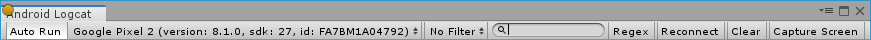

## **Overview**

Android Logcat Package is a utility for displaying log messages coming from an Android device in the Unity Editor. Read more about [Android Logcat Document](https://developer.android.com/studio/command-line/logcat).

**Requirements**
- Compatible with Unity 2019.1 or above.
- Requires Unity's Android support module.
- Active platform in Unity has to be set to Android.

**Supported features**
- Device connnection
	- Via USB
	- Via Wifi
- Device selection
- Package selection
- Log 
	- Copy
	- Save
	- Clear
	- Filter by
		- Priority
		- Tag
        - Process Id
	- Search by
		- Text
		- Regex
- Auto run
- Screen capture
- Stacktrace resolving

## **Using Android Logcat**

The toolbar is on the top of the window. Most Android Logcat controls can be found here.  

### Auto Run
When **Auto Run** is toggled, Android Logcat window will be launched automatically if you do **Build And Run** in **Build Settings** window.

### Stacktrace Resolving
One benefit of using Android Logcat package is automatic stacktrace resolving. The **addr2line** tool in Android NDK is used to convert the addresses in the crash logs to the file names and line numbers. Below is an example of what's added to the log.

**_The original log from Android logcat_**

	E CRASH   :      #01  pc 01c65330  /data/app/com.CrashComp.Crash-J2Z_L0XSsSAZPkt9lab2rQ==/lib/arm/libunity.so(DiagnosticsUtils_Bindings::ForceCrash(DiagnosticsUtils_Bindings::ForcedCrashCategory, ScriptingExceptionPtr*)+48)

**_The log shown in Android Logcat window in the Unity Editor_**

	Error CRASH: 	#01  pc 01c65330  /data/app/com.CrashComp.Crash-J2Z_L0XSsSAZPkt9lab2rQ==/lib/arm/libunity.so DiagnosticsUtils_Bindings::ForceCrash(DiagnosticsUtils_Bindings::ForcedCrashCategory, ScriptingExceptionPtr*) at ../Runtime/Export/Diagnostics/DiagnosticsUtils.bindings.cpp:25

To use this feature, you need to 
- Have Android NDK installed and set the NDK path in Unity (Menu: **Editor** \> **Preferences...** \> **External Tools**).
- Have the corresponding symbol files installed with Unity.
