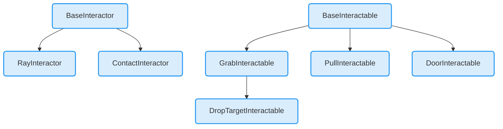

# xrff_class_hierarchy


# xrft_interaction_update.png
```mermaid
%% Interaction
  sequenceDiagram
    participant Interactor
    participant InteractionMananger
    participant Interactable
    Note over InteractionMananger: Get valid target Interactable for a given Interactor
    InteractionMananger->>Interactor: GetValidTargets
    Note over InteractionMananger: Clear selections that are no longer valid
    InteractionMananger->>Interactor: OnSelectExited
    InteractionMananger->>Interactable: OnSelectExited
    Note over InteractionMananger: Clear hovers that are no longer valid
    InteractionMananger->>Interactor: OnHoverExited
    InteractionMananger->>Interactable: OnHoverExited
    Note over InteractionMananger: Peform selection of valid interactables in valid targets list
    InteractionMananger->>Interactor: CanSelect
    InteractionMananger->>Interactable: IsSelectableBy
    InteractionMananger->>Interactor: OnSelectEntered
    InteractionMananger->>Interactable: OnSelectEntered
    Note over InteractionMananger: Peform hover of valid interactables in valid targets list
    InteractionMananger->>Interactor: CanHover
    InteractionMananger->>Interactable: IsHoverableBy
    InteractionMananger->>Interactor: OnHoverEntered
    InteractionMananger->>Interactable: OnHoverEntered
    classDef blue fill:#daedfd, stroke:#2196f3, stroke-width:2px, rx:5, ry:5;
    class BaseInteractor,RayInteractor,ContactInteractor blue
    class BaseInteractable,GrabInteractable,PullInteractable blue
    class DoorInteractable,DropTargetInteractable blue
```
