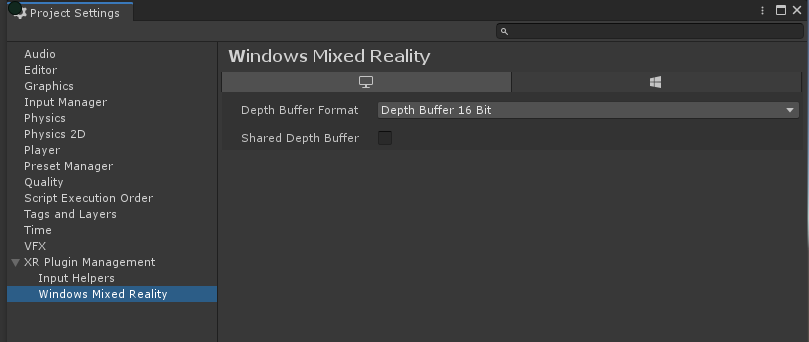
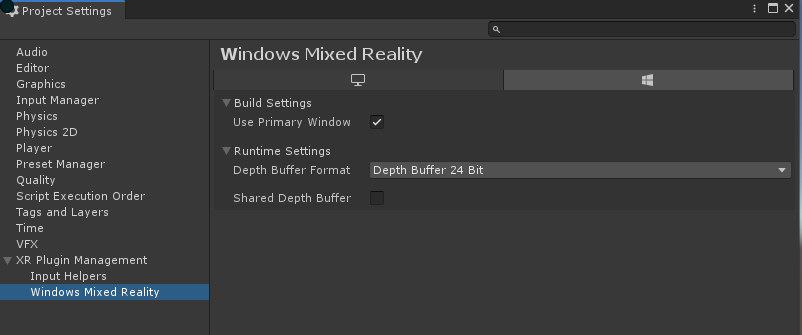

# About XR SDK for Windows MR

This package provides an XR SDK implementation of _Windows Mixed Reality_ support for Unity.

# Supported rendering modes

Windows Mixed Reality supports only one rendering mode for XR SDK: Single Pass Instancing (SPI). This is a limitation of the current underlying Windows API. Supporting any other rendering mode requires generating intermediate textures and blit-ing those textures to the current SPI buffers, introducing very expensive intermediate copy operations. For this reason, there is no means for changing rendering mode for the XR SDK Windows MR plug-in.

# Supported XR SDK Subsystems

Please see the [XR SDK documentation](https://github.cds.internal.unity3d.com/unity/xr.sdk) for information on all subsystems implemented here.

## Session

Subsystem implementation provides for initialization and management of the global _Windows Mixed Reality_ state. Also provides handling for handling pause/resume state changes.

This subsystem is required to successfully initialize before initializing any other subsystem defined below.

Session also provides two properties that reflect tracking state information. These properties are driven by the [SpatialLocatability](https://docs.microsoft.com/en-us/uwp/api/windows.perception.spatial.spatiallocatability) state of the [SpatialLocator](https://docs.microsoft.com/en-us/uwp/api/windows.perception.spatial.spatiallocator) instance. We map these states as follows:

Tracking State and Not Tracking Reason should map Locatability like this

|SpatialLocatability|Tracking State|Not Tracking Reason|
|-------------------|--------------|-------------------|
|Unavailable|Limited|None|
|PositionalTrackingActivating|None|Initializing|
|OrientationOnly|Tracking|Initializing|
|PositionalTrackingInhibited|None|Relocalizing|
|PositionalTrackingActive|Tracking|None|
|Anything else|None|None|


## Display

Subsystem implementation of the Display subsystem to allow for rendering of the VR view in the HMD or on HoloLens device.


## Input

Subsystem implementation of the Input subsystem to allow for tracking of device position/orientation, controller data, etc. Information provided to the subsystem from the provider is surfaced through [Tracked Pose Driver](https://docs.unity3d.com/ScriptReference/SpatialTracking.TrackedPoseDriver.html).

Hand tracking for HoloLens has been implemented differently than in Unity Legacy VR. With the advent of HoloLens v2 and true hand tracking the need and desire to maintain inferred handtracking is diminished. Inferred hand tracking has been a source of issues for Unity and developers and while it did provide some benefits the issues outweighed those significantly. For XR SDK the decision has been made to rely on the system to tell us what hands are being tracked and, if that information on handedness is missing, to just produce a generic tracked hand device with no handedness inference.

To use the new hand model, the user needs to talk to the input system directly becuase the current Tracked Pose Driver system does not natively support non-handed hands. A user can do this by providing an implementation of **BasePoseProvider** from the Interaction package to a Tracked Posed Driver component and using that as the pose provider for unhanded situations. The Interaction package is installable through either the [Package Manager](https://docs.unity3d.com/Documentation/Manual/Packages.html) ui or through the **XR Plugin Management/Input Helpers** settings pane in **Project Settings**.

An example implementation of a hand pose provider is shown below. This example is limited to tracking one of two hands consisting of the first two devices that support hand tracking as reported by the input subsystem. This is specifically for hand tracked devices that do not support handedness as the current Tracked Pose Driver does recognize 

```{code:c#}
using System.Collections.Generic;
using System.Linq;
using UnityEngine;
using UnityEngine.Experimental.XR.Interaction;
using UnityEngine.SpatialTracking;
using UnityEngine.XR;

public class HandTrackingProvider : BasePoseProvider
{
    // Choose between first or second han dtracked devices.
    [Range(0,1)]
    public int controllerIndex;

    public override PoseDataFlags GetPoseFromProvider(out Pose output)
    {
        output = default(Pose);
        var device = default(InputDevice);
        var flags = PoseDataFlags.NoData;

        List<InputDevice> devices = new List<InputDevice>();
        InputDevices.GetDevicesWithCharacteristics(InputDeviceCharacteristics.HandTracking, devices);
        if (devices.Count < controllerIndex + 1)
        {
            return flags;
        }

        device = devices.ElementAt(controllerIndex);

        if (!device.isValid)
            return flags;

        // Check for handedness
        // bool leftHand = ((device.characteristics & InputDeviceCharacteristics.Left) == InputDeviceCharacteristics.Left);
        // bool rightHand = ((device.characteristics & InputDeviceCharacteristics.Right) == InputDeviceCharacteristics.Right);
        // Do something here with handedness if you need to
        
        if (device.TryGetFeatureValue(CommonUsages.devicePosition, out output.position))
            flags |= PoseDataFlags.Position;
        if (device.TryGetFeatureValue(CommonUsages.deviceRotation, out output.rotation))
            flags |= PoseDataFlags.Rotation;

        return flags;
    }
}
```

## Gesture

Subsystem implementation to provide for recognition and tracking of gestures provided from the appropriate device.  This subsystem relies on the `com.unity.xr.interactionsubsystem` package for it's core implementation (see that package's documentation for further details/types).

The `WindowsMRGestureSubsystem` component manages a low-level interface for polling for Windows Mixed Reality gesture changes.  If this component is added to a scene, it is possible to poll for any gesture events each frame.  The following gestures and gesture data are provided:

* __WindowsMRHoldGestureEvent__ - Event that fires when the state of a hold gesture changes.  Hold gesture indicating that a air tap or button has been held down my the user.
  * __id__ - Unique `GestureId` that identifies this gesture. 
  * __state__ - `GestureState` that indicates the state of this gesture (`Started`, `Updated`, `Completed`, `Canceled` or `Discrete`).
* __WindowsMRTappedGestureEvent__ - Event that fires when the state of a tapped gesture changes.  Tapped gestures indicate an air tap or button has been tapped by the user.
  * __id__ - Unique `GestureId` that identifies this gesture. 
  * __state__ - `GestureState` that indicates the state of this gesture (`Started`, `Updated`, `Completed`, `Canceled` or `Discrete`).
  * __tappedCount__ - Number of times that the tap has occurred.
* __WindowsMRManipulationGestureEvent__ - Manipulation gestures can be used to move, resize or rotate an object when it should react 1:1 to the user's hand movements. One use for such 1:1 movements is to let the user draw or paint in the world. The initial targeting for a manipulation gesture should be done by gaze or pointing. Once the tap and hold starts, any manipulation of the object is then handled by hand movements, freeing the user to look around while they manipulate.
  * __id__ - Unique `GestureId` that identifies this gesture. 
  * __state__ - `GestureState` that indicates the state of this gesture (`Started`, `Updated`, `Completed`, `Canceled` or `Discrete`).
  * __cumulativeDelta__ - `Vector3` indicating the total distance moved since the beginning of the manipulation gesture.
* __WindowsMRNavigationGestureEvent__ - Navigation gestures operate like a virtual joystick, and can be used to navigate UI widgets, such as radial menus. You tap and hold to start the gesture and then move your hand within a normalized 3D cube, centered around the initial press. You can move your hand along the X, Y or Z axis from a value of -1 to 1, with 0 being the starting point.
  * __id__ - Unique `GestureId` that identifies this gesture. 
  * __state__ - `GestureState` that indicates the state of this gesture (`Started`, `Updated`, `Completed`, `Canceled` or `Discrete`).
  * __normalizedOffset__ - `Vector3` indicating the normalized offset, since the navigation gesture began, of the input within the unit cube for the navigation gesture.

Additionally, the `WindowsMRGestures` component can be used to provide a simpler polling mechanism for a simpler, event-based interface for listening to gestures.  This component provides a number of events that be hooked into to detect gesture events when they occur:

* __onHoldChanged__ - Occurs whenever a hold gesture changes state.
* __onManipulationChanged__ - Occurs whenever a manipulation gesture changes state.
* __onNavigationChanged__ - Occurs whenever a navigation gesture changes state.
* __onTappedChanged__ - Occurs whenever a tapped gesture changes state.
* __onActivate__ - Occurs whenever the cross-platform activate gesture occurs.  See the `com.unity.xr.interactionsubsystems` package documentation for more details.

Also see the relevant [Microsoft documentation](https://docs.microsoft.com/en-us/windows/mixed-reality/gestures) about Gestures for supported device information.

## Anchor

Subsystem implementation provides support for anchors within the Microsoft anchor system.

Successful initialization and start of the subsystem allows the user to Add anchors, Remove anchors and Query for all known anchors. Current subsystem definition does not provide for storage or retrieval of stored anchors.

See the relevant [Microsoft documentation](https://docs.microsoft.com/en-us/windows/mixed-reality/spatial-anchors) about Anchors for supported device information.

The subsystem provided the ability to get the actual native Windows MR object that backs the anchor. Below is an example of getting that data:

```
TrackableChanges<XRAnchor>? currentRps = RPSubsystem?.GetChanges(Allocator.Temp) ?? null;

if (currentRps != null)
{
    foreach(var rp in currentRps?.added)
    {
#if ENABLE_WINMD_SUPPORT // Necessary since the Windows Types are only valid through WinMD projection.
        AnchorData data = Marshal.PtrToStructure<AnchorData>(rp.nativePtr);
        SpatialAnchor anchor = data.spatialAnchor as SpatialAnchor;
        if (anchor != null)
        {
            // Do something with the anchor here.
        }
#endif
    }
}
```
NOTE: The data returned is only valid in between calls to **XRAnchor.GetChanges**!

## Meshing

Subsystem implementation provides access to the meshing constructs the that HoloLens hardware produces. This subsystem only works on devices that actually support meshing (HoloLens) and should either be null or in a non-running state for other devices.

See the relevant [Microsoft documentation](https://docs.microsoft.com/en-us/windows/mixed-reality/spatial-mapping) about Spatial Mapping for supported device information as well as what to expect in regards to data from this subsystem.


# Additional support outside of XR SDK

There are a number of features that _Windows Mixed Reality_ supports that are not provided for in XR SDK. These are provided for use through the following extensions:

## Input Subsystem Extensions

Specific to this package is the ability to get the native WindowsMR [SpatialInteractionSourceState](https://docs.microsoft.com/en-us/uwp/api/windows.ui.input.spatial.spatialinteractionsourcestate) that backs the input data.

* __GetCurrentSourceStates__ - Retrieve an array of all the currently known source states the input system knows about. These are returned as an array of System.Object that can be converted to the appropriate **SpatialInteractionSourceState** instance to use.
  
Here is an example:

``` 
List<System.Object> states = new List<System.Object>();

...

InputSubsystemInstance?.GetCurrentSourceStates(states) ?? null;

#if ENABLE_WINMD_SUPPORT
  foreach (var s in states)
  {
      SpatialInteractionSourceState sourceState = s as SpatialInteractionSourceState;
      if (sourceState == null)
      {
          // Could not convert.
          continue;
      }

      string sourceInfo = $"Source Info for state\n";
      sourceInfo += $"\tGrasped: {sourceState.IsGrasped}\n";
      sourceInfo += $"\tMenu Pressed: {sourceState.IsMenuPressed}\n";
      sourceInfo += $"\tPressed: {sourceState.IsPressed}\n";
      sourceInfo += $"\tSelect Pressed: {sourceState.IsSelectPressed}\n";
      sourceInfo += $"\tSelect Press Value: {sourceState.SelectPressedValue}\n";
      Debug.Log(sourceInfo);
  }
#endif
```

## Meshing Subsystem Extensions

Meshing subsystem provides only one means for setting a bounding volume for spatial mapping: __SpatialBoundingVolumeBox__. This API provides for settings a bounding volume as an Axis Aligned Bounding Box at a given position given specific extents. _Windows Mixed Reality_ additionally provides for setting a bounding volume as an Oriented Bounding Box, a Sphere or a Frustum.

* __SetBoundingVolumeOrientedBox__ - Similar to __SpatialBoundingVolumeBox__ but also allows for setting a given orientation to the volume.
* __SetBoundingVolumeSphere__ - Set a bounding volume to a sphere at some origin point and with the given radius.
* __SetBoundingVolumeFrustum__ - Set the bounding volume to the frustum defined by the 6 planes passed in. Each plane is defined as a point offset from the head, with a given orientation. The easiest way to set this is to use the [GeometryUtility.CalculateFrustumPlanes](https://docs.unity3d.com/ScriptReference/GeometryUtility.CalculateFrustumPlanes.html) Unity API and use that to populate the data for this call. The plane ordering passed in matches the plane ordering from this API.

Specific to this package is the ability to get the native WindowsMR [SpatialSurfaceMesh](https://docs.microsoft.com/en-us/uwp/api/windows.perception.spatial.surfaces.spatialsurfacemesh) and [SpatialSurfaceInfo](https://docs.microsoft.com/en-us/uwp/api/windows.perception.spatial.surfaces.spatialsurfaceinfo) the back the generated mesh data. In the future meshing will support the same native pointer access that anchors does but for now you can use this package specific mechanism to get the same data.

* __WindowsMRExtensions.MeshingData__ - Container struct that holds data for the native mesh information. Contains the following data members:
    * int version - The version of this struct. This will let you know what version the provider is returning to you so you know what to expect.
    * System.Object surfaceInfo - A pointer to the native **SpatialSurfaceInfo** info for this mesh. Must be case to **SpatialSurfaceInfo** to be useful.
    * System.Object surfaceMesh - A pointer to the native **SpatialSurfaceMesh** info for this mesh. Must be case to **SpatialSurfaceMesh** to be useful.

* __GetMeshingDataForMesh__ - Extension method on **XRMeshSubsystem**. Given a mesh id will populate the passed in instance of MeshingData with the native mesh information.
* __ReleaseMeshingData__ - Extension method on **XRMeshSubsystem**. Used to release the data in a MeshingData instance returned from **GetMeshingDataForMesh**.

Here is an example:

``` 
var meshing = m_XrManagerSettings.activeLoader.GetLoadedSubsystem<XRMeshSubsystem>();
WindowsMRExtensions.MeshingData meshData = new WindowsMRExtensions.MeshingData();
...
/// Get mesh info instance
...
meshing.GetMeshingDataForMesh(meshInfo.MeshId, out meshData);
#if ENABLE_WINMD_SUPPORT
SpatialSurfaceInfo surfaceInfo = meshData.surfaceInfo as SpatialSurfaceInfo;
SpatialSurfaceMesh surfaceMesh = meshData.surfaceMesh as SpatialSurfaceMesh;
Debug.Log($"Spatial Surface Info: ID:{surfaceInfo.Id} UpdateTime: {surfaceInfo.UpdateTime}");
Debug.Log($"Spatial Surface Mesh Info: Vertex Count:{surfaceMesh.VertexPositions.ElementCount} Normals Count:{surfaceMesh.VertexNormals.ElementCount} Indices Count: {surfaceMesh.TriangleIndices.ElementCount}");
#endif
meshing.ReleaseMeshingData(ref meshData);
```

## Anchor Subsystem Extensions

# XR Management support

While not required to use _Windows Mixed Reality_ XR Plugin, integration with XR Management provides for a simpler and easier way of using this (and other) providers within Unity. This package provides for the following XR Management support:

* Runtime Settings - Provides for setting runtime settings to be used by the provider instance. These settings are per-supported platform.
* Build Settings - Provides for setting build settings to be used by the Unity build system. These settings are platform specific and are used to enable boot time settings as well as copy appropriate data to the build target.
* Lifecycle management - This package provides a default XR SDK Loader instance that can be used either directly or with the XR Management global manager. It provides for automated (or manual) lifetime management for all the subsystems that are implemented by this provider.
* Integration with Unity Settings UI - Custom editors and placement within the Unity Unified Settings UI within the top level XR settings area.

# Installing the _Windows Mixed Reality_ XR Plugin :

To install the _Windows Mixed Reality_ XR Plugin, do the following:
1. Install the XR Management package from [Package Manager](https://docs.unity3d.com/Packages/com.unity.package-manager-ui@latest/index.html)
2) Follow the instrucions for [Installing an XR Plugin using XR Management](https://docs.unity3d.com/Packages/com.unity.xr.management@latest) in the End User Documentation section.

Note that the XR settings tab now has a dropdown for "Windows Mixed Reality". Navigate to the **XR Plugin Management** -> **Windows Mixed Reality** settings window in Project Settings to create a Windows MR XR Plugin specific settings asset. This asset is editable from the **Windows Mixed Reality** window and can toggle settings such as Shared Depth buffer support.


# Windows Standlone Settings



## Runtime Settings

* __Shared Depth Buffer__ - Enabled or disable support for using a shared depth buffer. This allows Unity and the Mixed Reality Subsystem to use a common depth buffer. This allows the _Windows Mixed Reality_ system to provide better stabilization and integrated overlay support. Disabled by default.

* __Depth Buffer Format__ - Switch to determine the bit-depth of the depth buffer when sharing is enabled. Possible depth formats are _16bit_ and _24 bit_.

# Windows UWP Settings



## Build Settings
* __Use Primary Window__ - Toggle to set the provider instance to immediately initialize XR SDK using the primary UWP window spawned by Unity. Set enabled by default. WSA/UWP Only.

## Runtime Settings

* __Shared Depth Buffer__ - Enabled or disable support for using a shared depth buffer. This allows Unity and the Mixed Reality Subsystem to use a common depth buffer. This allows the _Windows Mixed Reality_ system to provide better stabilization and integrated overlay support. Disabled by default.

* __Depth Buffer Format__ - Switch to determine the bit-depth of the depth buffer when sharing is enabled. Possible depth formats are _16bit_ and _24 bit_.

## XR Management Loader

The default loader provided by the _Windows Mixed Reality_ XR Plugin implementation is setup to use all the subsystems provided by this implementation. The only required subsystem is __Session__ which means that failure to initialize __Session__ will cause the loader to fail init and fall through to the next expected loader.

If __Session__ successfully initializes, then it is still possible for starting the subsystem could fail. If starting fails then the loader will clear all the subsystems and the app will fall through to standard Unity non-VR view.

All other subsystems depend on session but, unlike session, failure to initialize or start will not cause the whole provider to fail.

